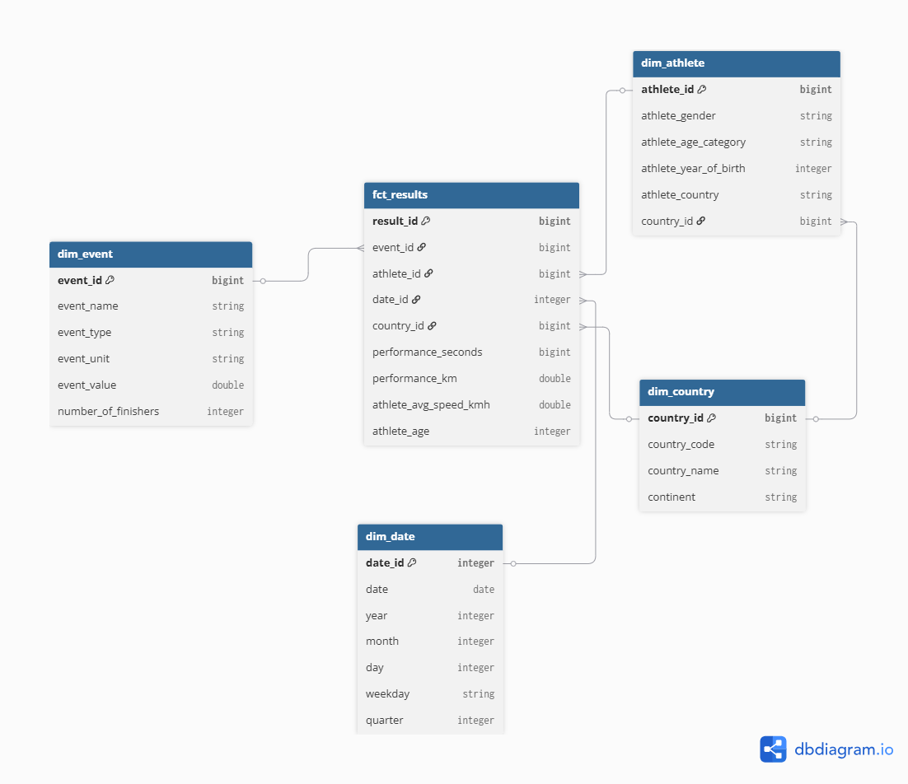

# Marathos — Indira Mahadiva

I built a Databricks data platform for Marathos, a fictional global marathon-hosting company.

Dataset: [The Big Dataset of Ultra-Marathon Running](https://www.kaggle.com/datasets/aiaiaidavid/the-big-dataset-of-ultra-marathon-running) (Kaggle, ~7.5M rows, 1798–2022).

---

## Tech stack

- Databricks (free edition) + Unity Catalog
- Delta Live Tables (DLT) for the pipeline
- PySpark + SQL
- Plotly for EDA visualizations
- AI/BI Dashboards
- Genie

---

## Architecture

Medallion architecture: bronze → silver → gold, all built as one DLT pipeline.



- **Bronze** — streaming tables ingesting raw CSVs from a Unity Catalog volume
- **Silver** — one-big-table (`marathon_obt`) with all cleaning applied
- **Gold** — star schema (1 fact + 4 dims) + 4 business views
- **Consumers** — AI/BI dashboard + Genie 

---

## Repo structure

```
marathos_Indira_Mahadiva/
├── README.md
├── dimensional_modeling/
│   └── dimensional_model.png
├── transformations/
│   ├── bronze/
│   │   ├── raw_marathon.py
│   │   └── raw_country.py
│   ├── silver/
│   │   └── marathon_obt.py
│   └── gold/
│       ├── dim_country.sql
│       ├── dim_date.sql
│       ├── dim_event.sql
│       ├── dim_athlete.sql
│       ├── fct_results.sql
│       ├── view_distance_top_countries.sql
│       ├── view_distance_age_performance.sql
│       ├── view_duration_top_distance.sql
│       └── view_duration_country_avg.sql
├── utils/
│   └── utils.py
└── explorations/
    ├── initial_setup.dbquery.ipynb
    ├── eda_bronze.ipynb
    ├── eda_silver.ipynb
    ├── eda_gold.ipynb
    └── genie_demo.dbquery.ipynb
```

---

## Bonuses implemented (4)

| # | Bonus | What |
|---|---|---|
| 1 | `dim_country` with continent | LLM-generated IOC code → name + continent CSV, ingested as its own bronze stream, joined into `dim_athlete` and `fct_results` |
| 2 | Generated `dim_date` | Not derived from data — uses `sequence(DATE'2000-01-01', DATE'2030-12-31', INTERVAL 1 DAY)` |
| 3 | Scheduled pipeline | Daily Databricks Workflow trigger |
| 4 | Streamed a new marathon | Generated a synthetic Stockholm Ultra 2026 CSV (250 runners), dropped into bronze volume, picked up incrementally without code changes |

---

## LLM usage

- I used an LLM to help with a few specific parts of this lab, but never to solve a whole task end-to-end. The `ioc_countries.csv` file was LLM-generated — 218 rows mapping IOC codes to country names and continents.

- In the silver layer (`marathon_obt.py`), the LLM helped me refine regex patterns for parsing performance strings, and suggested using `xxhash64` and `sha2` instead of `dense_rank` for streaming-safe surrogate IDs (a constraint my teacher's lab feedback also confirmed). 

- The synthetic Stockholm Ultra 2026 CSV (bonus 4) was produced by an LLM. I reviewed it line-by-line — I understand how the schema matches the source, how the random distributions create plausible 100km finish times, and how the bronze streaming table picks up the new file incrementally.

